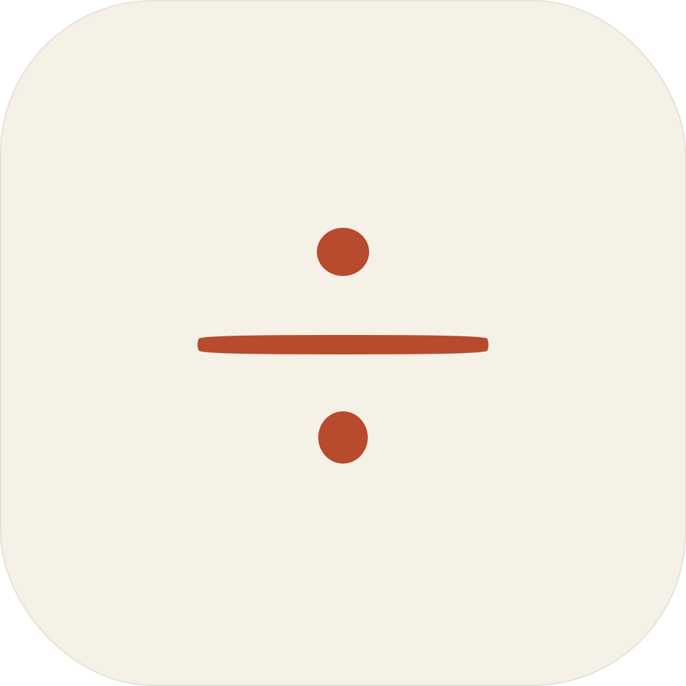

<p align="center">
  
</p>

# Obelus

[](https://github.com/4gentic/obelus/actions/workflows/ci.yml)
[](LICENSE)
[](.nvmrc)
[](https://github.com/4gentic/obelus)

*Mark what you doubt.*

An offline review surface for AI-assisted papers — paired with a Claude Code plugin that applies your review back to the source.

> In medieval manuscripts, scribes drew a small mark — the obelus, `÷` — in the margin of any passage they judged doubtful. When most of a paper is generated by a model, writing is cheap and review is expensive. Obelus is a tool for marking doubt.

*A project by [4gentic](https://4gentic.ai) — a small studio building offline tools for people who write.*

## What it does

1. Open the web or desktop app. Drop a **PDF**, **Markdown** *(Beta)*, or **HTML** *(Beta)* paper.
2. Highlight passages, write margin notes, categorize each mark, thread comments, apply a per-paper rubric.
3. Export a **review bundle** — a single JSON file with enough context to locate every passage in your source.
4. In your paper's repo, run `/apply-revision <bundle>`. The plugin detects your source format (`.tex` / `.md` / `.typ` / `.html`), plans a minimal-diff fix, and — on your confirmation — applies it.

The apps never see the network at runtime. No telemetry, no analytics, no counters — your draft never leaves the device.

## Use cases

- **The advisor.** Marks weak arguments and unclear paragraphs in a student's AI-drafted Markdown chapter. Hands back a bundle; the student runs `/apply-revision` and reviews the diff.
- **The peer reviewer, offline.** Drops a conference PDF on a plane. Returns with a structured Major/Minor reviewer's letter generated by `/write-review`.
- **The co-author team.** Writer renders LaTeX to HTML preview; reviewer marks the HTML; writer accepts diffs hunk by hunk in the desktop app.
- **The triage stack.** A reading list of arXiv PDFs lands in a desktop "desk" — quick passes per paper, one consolidated bundle, per-paper write-ups out the other side.

## Why it's different

- **Offline by construction.** PDFs in OPFS, annotations in IndexedDB. No network at runtime. External assets in HTML/Markdown papers are stripped before the DOM loads them.
- **Source-anchored marks.** Selections carry their origin: PDF bbox, Markdown line/col, HTML XPath — not screenshots, not page numbers.
- **Format-agnostic.** PDF · Markdown *(Beta)* · HTML *(Beta)* on the review side; `.tex` · `.md` · `.typ` · `.html` on the apply side.
- **Editorial surface.** Three columns: paper · 220px margin gutter · review pane. Margin notes align vertically to their source line.
- **Plugin is optional.** The bundle is plain JSON; the exported Markdown is self-describing. Use any coding agent.
- Not a cloud service, not a PDF editor, not a collaboration tool — by design.

## Install

**Web app** — visit [obelus.4gentic.ai](https://obelus.4gentic.ai). Installable as a PWA, fully functional offline after first load. PDF, Markdown, and HTML review; bundle export.

**Desktop app** — Tauri v2 build. Adds source editing in CodeMirror, a git-style diff review pane, project folders, managed Typst/Tectonic engines, and Claude Code in-app. Downloads land under [Releases](https://github.com/4gentic/obelus/releases) once the v1 pipeline ships.

> First launch notes. Desktop builds are unsigned in v1. macOS will refuse the first launch with "cannot be opened because it is from an unidentified developer" — right-click the app → **Open** once, and macOS remembers. Windows SmartScreen shows "Unrecognized app" — click **More info** → **Run anyway**. Linux AppImages run directly. Signed releases are planned post-v1.

**Claude Code plugin** — in your paper repo:

```sh
/plugin marketplace add 4gentic/obelus
/plugin install obelus@4gentic
```

Skills: `/apply-revision`, `/apply-fix`, `/write-review`, `/fix-compile`. See [`packages/claude-plugin/README.md`](packages/claude-plugin/README.md).

## Repo layout

```
apps/
  web/              Vite + React + TypeScript. Landing + PWA.
  desktop/          Tauri v2 app (Rust + React renderer).
packages/
  bundle-schema/    The bundle contract (Zod + JSON Schema).
  bundle-builder/   Pure builder: Repository + ids → Bundle.
  anchor/           PDF/source/HTML anchoring primitives.
  pdf-view/         PdfDocument + PdfPage + SelectionListener.
  md-view/          Markdown adapter (line/col anchors).
  html-view/        HTML adapter (shadow-DOM, XPath anchors).
  source-render/    remark/rehype pipeline; OPFS asset rewriter.
  review-shell/     Three-column layout + DocumentView contract.
  repo/             Repository interface, Dexie (web), SQLite (desktop).
  categories/       Default categories + per-project overrides.
  claude-sidecar/   Desktop-only: Rust spawn + TS event contract.
  claude-plugin/    The .claude/ shipped to users.
  design-tokens/    tokens.css + TS constants.
brand/              Marks, favicons, OG image.
```

## Develop

```sh
pnpm install
pnpm dev                          # web app on :5173
pnpm --filter desktop dev         # desktop app (requires Rust toolchain)
pnpm verify                       # lint + typecheck + test + network-guard + build
```

## Releasing

Maintainer-facing. See [`docs/RELEASING.md`](docs/RELEASING.md) for the tag-driven release flow, updater-keypair setup, and signing-secret checklist.

## Security

Report vulnerabilities privately to `engineering@4gentic.ai` or follow the process in [`SECURITY.md`](SECURITY.md). Do not file a public issue for a security report.

## Contribute

Read [`CONTRIBUTING.md`](CONTRIBUTING.md) first. Open issues tagged `good-first-mark` are scoped for a first contribution. The aesthetic invariants and code conventions in [`CLAUDE.md`](CLAUDE.md) are not negotiable; the persona charters in `.claude/agents/` say which area owns what.

*If Obelus is useful to you, [star the repo](https://github.com/4gentic/obelus).*

## License

MIT. Brand assets are MIT too — use the wordmark freely when linking back.
