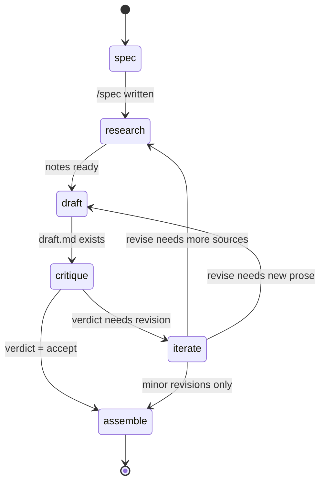

# Drafter mode — design + spike

Status: **design + spike, not yet shipping.** This doc lands together with a
skeleton in `packages/claude-plugin-drafter/`, a shared TS package
`packages/drafter-core/`, and a hidden desktop tab gated behind
`VITE_DRAFTER_PREVIEW=1`. The full workflow is intentionally deferred — this
doc is the spec the next worktree executes against.

The source material is the sibling project at
`/Users/juan/Projects/4gentic/negotiated_autonomy/`, which ships a six-persona
twenty-command workflow for authoring a Typst-based arXiv paper. The full set
is described in its `CLAUDE.md` and in `.claude/{agents,commands}/`. This
doc ports a reduced subset into Obelus's product framing — paper review and
paper drafting as two faces of the same offline-first, format-agnostic surface.

---

## 1. Why drafter, why a sibling to reviewer

Obelus today is the **reviewer** surface — a browser-only review pane on top of
a PDF, with a JSON bundle handed to a coding agent that applies minimal-diff
edits to the source. Reviewing is the work the user identified as the binding
constraint: writing AI-assisted papers is cheap, reviewing them is what takes
expertise and time.

The **drafter** surface is the inverse: produce paper sections from a goal,
section by section, with an explicit workflow the user can stop and inspect at
every stage. The user has called this out as "the best functionality by far"
and the sibling project demonstrates it works at the persona/command level.

Drafter is a sibling, not a successor. The two surfaces share the paper, the
project root, and the agent runtime; they do different things to the same
artifacts.

| Surface  | Input                | Output                                | Loop                                         |
| -------- | -------------------- | ------------------------------------- | -------------------------------------------- |
| Reviewer | PDF + on-page marks  | A bundle the plugin applies to source | Annotation → bundle → plan → applied edits   |
| Drafter  | `paper/goal.md` + state | Section markdown / `.tex` / `.typ`    | Spec → research → draft → critique → iterate |

Treating them as siblings keeps each one focused: the reviewer plugin owns
bundles and applied edits, the drafter plugin owns sections and stages.

---

## 2. Recommendation: a separate marketplace plugin

**`packages/claude-plugin-drafter/`** (Claude Code plugin id: `obelus-drafter`).

### Justification

1. **Reviewer stays focused.** `obelus` (the reviewer plugin) ships four
   skills (`apply-revision`, `write-review`, `apply-fix`, `plan-fix`) and a
   single `paper-reviewer` subagent. Adding six more commands and four more
   personas to the same plugin doubles its surface and makes the install
   prompt confusing ("does installing Obelus get me drafting too?").
2. **Independent install.** Users want one or the other, or both. Marketplace
   listings let them choose; bundling forces both.
3. **Independent versioning.** The reviewer plugin's bundle contract is
   stable; the drafter plugin's stage state machine is going to churn. Pinning
   them separately lets one ship 1.x while the other is still 0.x.
4. **No regression risk on the existing reviewer flow.** The drafter plugin
   does not touch `apply-revision` or `write-review`; nothing in the existing
   plugin's e2e suite changes.

### What is shared, what is plugin-private

Shared across the monorepo (used by both plugins and both apps):

- `packages/bundle-schema` — the review bundle contract. The drafter does not
  produce bundles, but the schema's `ProjectKind`, `ProjectFileFormat`, and
  rubric shapes are reusable framing.
- `packages/prompts` — the single source of truth for prompt fragments
  (voice, refusals, sentinels, category map). The drafter persona prompts pull
  from `voice` and `refusals` exactly as `paper-reviewer` does.
- `packages/claude-sidecar` — the React → Tauri bridge that spawns the
  `claude` CLI and parses `--output-format stream-json`. The drafter UI uses
  the same `claudeSpawn` / `claudeAsk` calls.
- `packages/drafter-core` (new, in this worktree) — the `paper.draft.json`
  Zod schema, the stage state machine, and pure utilities. No I/O. Both the
  desktop and (for read-only preview) the web import this.

Drafter-plugin-private:

- The four ported personas as `agents/*.md` files.
- The six ported commands as `commands/*.md` files.
- A `skills/` directory if any of the commands grow shared sub-behaviour. v1
  has none — each command stands alone.
- Per-persona instruction text. Where the language overlaps with reviewer
  prompts (the voice rules, the refusal pattern), the markdown uses the same
  `<!-- @prompts:voice -->` style include marker the reviewer plugin uses; the
  shared `pnpm prompts:render` step keeps the two in sync.

### Not shared, on purpose

- `paper-reviewer` (the subagent currently in `packages/claude-plugin/agents/`).
  Its job is to critique a *single proposed edit*; the drafter's `critic`
  persona critiques whole sections in one of three personas (reviewer-2,
  area-chair, practitioner). The two are different enough in inputs and
  outputs that sharing the file would force a fork inside it. Open question
  in §10 on whether to revisit this.

---

## 3. Personas to port (4 of negotiated_autonomy's 6)

Read the sibling project's full agent definitions in
`/Users/juan/Projects/4gentic/negotiated_autonomy/.claude/agents/` before
reading this section. Below are the trimmed scopes for the Obelus drafter.

### `research-lead`

Drafts and revises paper sections. Reads `paper/goal.md` first as binding
framing, then existing `paper/sections/*` to keep voice consistent. Writes
section files at `paper/sections/<NN>-<slug>.md` (or `.tex` / `.typ` per the
project's detected format). Owns the argument arc — every section reads as one
author. Refuses to edit `paper/main.*` or `paper/bibliography.bib` (the
literature-scout's domain).

### `critic`

Adversarial reviewer for paper sections. Three personas in v1, selected via
the `/critique --persona` flag:

- **reviewer-2** — hostile but competent peer reviewer. Default for paper
  sections. Flags unsupported claims, missing citations, weak empirics,
  ambiguous formalism, contribution opacity.
- **area-chair** — senior reviewer who decides accept / revise / reject.
  Focus on novelty, defensibility, citability.
- **practitioner** — engineer-as-reader. Focus on whether the framing is
  actionable for someone trying to apply the work.

Dropped from the sibling project's set: `security` and `open-readiness`.
Both are runtime-specific (review of a software artifact, scrubbing for
proprietary leakage). Neither carries over to Obelus's paper-only scope.

Writes critique files at `paper/reviews/<YYYYMMDD-HHMM>-<persona>-<slug>.md`.
Never edits the target.

### `literature-scout`

Maintains bibliography and per-paper notes. Given a topic or paper reference,
appends a BibTeX entry (or notes that a duplicate exists) and writes a
distilled note at `paper/notes/literature/<bibkey>.md`. Authority sources
preferred (arXiv, ACM, IEEE); LLM-generated summaries refused. The note
shape has a one-sentence summary, relevance to the paper, quotable passages,
critiques, and related refs in the bibliography.

### `storyteller` (optional in v1)

Compresses the paper into derivative outputs — abstract, lay summary, talk
abstract. Less central than the other three; gated to a future iteration so
v1 can ship without making derivative-format decisions. The persona file
ports cleanly when needed.

### Skipped, runtime-specific

- `implementer` — owns runtime code. Not applicable to paper-only Obelus.
- `operator` — owns deployment, traction data, case studies. Same reason.

---

## 4. Commands to port (6 of negotiated_autonomy's 20)

### `/spec <section-slug>`

Writes the section spec: goals, audience, length budget, dependencies on other
sections, and the arXiv-grade checklist for the section. Output goes to
`paper/sections/<NN>-<slug>/spec.md` (each section is a directory, see §7).
Reads `paper/goal.md` first, then any existing section spec or draft to
preserve what works. Reports the delta.

### `/research <topic>`

Delegates to `literature-scout`. Identifies 3–7 highly relevant papers on the
topic, dedupes against `paper/bibliography.bib`, writes per-paper notes at
`paper/notes/literature/<bibkey>.md`, and appends new BibTeX entries.
Reports a ranked list with one sentence per paper explaining why it matters.

### `/draft <section-slug>`

Delegates to `research-lead`. Reads the goal, reads the section's spec
(`paper/sections/<NN>-<slug>/spec.md`), reads any prior draft and prior
critiques (`paper/reviews/`), reads relevant bibliography notes, and produces
or revises `paper/sections/<NN>-<slug>/draft.md`. Reports the delta from any
prior version, citation TODOs added, and open questions for the user.

### `/critique <section-slug> [--persona reviewer-2|area-chair|practitioner]`

Delegates to `critic`. Default persona is `reviewer-2`. Reads the section's
draft, the goal, cited bibliography. Writes a structured critique file at
`paper/reviews/<YYYYMMDD-HHMM>-<persona>-<slug>.md` with verdict, blockers,
concerns, strengths, missed opportunities. Does not edit the target. Reports
the file path, the verdict, and the top three blockers.

### `/drift-check`

Delegates to `critic` with a `drift-check` framing. Reads `paper/goal.md`
and walks every section under `paper/sections/`. Answers: are we still
pursuing the same objective? Have non-goals crept in? Have tensions been
resolved or quietly abandoned? Writes a drift report at
`paper/reviews/<YYYYMMDD-HHMM>-drift-check.md` with goal alignment per
success criterion (met / partial / absent / drifted), non-goal incursions,
and a recommendation (continue / amend goal / amend plan). Reports the path
and a one-paragraph summary of the most important drift finding.

### `/assemble`

Updates the global `paper.draft.json` state (no LLM call). Re-scans
`paper/sections/`, refreshes each section's `lastUpdated`, and emits a
summary of which sections are at which stage. The deterministic
section-concatenation step from negotiated_autonomy's
`scripts/assemble_paper.py` is **not** ported — the desktop UI's preview
pane handles concatenation, and the export step is the user's existing build
toolchain (latexmk, typst, pandoc).

### Not ported in v1

- `/build`, `/test`, `/benchmark`, `/integrate` — runtime-specific.
- `/case-study`, `/diagram`, `/pitch`, `/formalize`, `/design` —
  optional / specialised / can be added incrementally.
- `/check-licenses`, `/open-readiness-gate`, `/open-readiness-scan` —
  runtime / OSS gates that don't apply to a paper-only surface.
- `/arxiv-pull` — useful but better as a `literature-scout` sub-action than
  its own command.

---

## 5. Workflow stages

Six stages, one per section, tracked in `paper.draft.json`:

```
spec → research → draft → critique → iterate → assemble
```

The state machine in ASCII:

```
                +---------+
        start ─►│  spec   │
                +---------+
                     │ /spec written
                     ▼
                +---------+
                │research │◄──────┐
                +---------+       │
                     │ notes ready
                     ▼            │
                +---------+       │
                │  draft  │       │
                +---------+       │
                     │ draft.md exists
                     ▼            │
                +---------+       │
                │critique │       │
                +---------+       │
                     │ verdict written
                     ▼            │
                +---------+       │
                │ iterate │ ──────┘  (loops back to research or draft)
                +---------+
                     │ critic verdict = accept / revise-minor
                     ▼
                +---------+
                │assemble │
                +---------+
```

Or as a Mermaid block (rendered on GitHub):



Notes on the state machine:

- Every section carries one `stage` value at a time. There is no parallel
  state per persona; the latest action sets the section's stage.
- Transitions are not enforced by the desktop UI in v1 — the user can run
  any command at any time. The `canAdvance` helper exists for the UI to
  highlight the *recommended* next stage, not to block manual runs.
- `iterate` is a logical state, not a command. A section enters `iterate`
  when `/critique` returns a non-accept verdict; the user then runs
  `/research` or `/draft` again to re-enter the loop. The UI labels this
  state "needs revision" and shows the latest critique inline.

The state machine is pure (`packages/drafter-core/src/state-machine.ts`),
so both apps consume the same semantics.

---

## 6. The Goal File pattern

`paper/goal.md` is hand-edited by the user. It is the source of truth for
what the paper is trying to prove — its success criteria, its non-goals, its
known tensions. Every persona reads it first as binding framing. The drafter
never writes to `paper/goal.md`; that file is the user's contract with
themselves.

The `/drift-check` command compares the current state of all sections to the
goal: are the success criteria being met or drifting? Has the section work
quietly imported a non-goal? Are the tensions noted in the goal still being
balanced, or has one collapsed silently? The output is a drift report the
user reads and acts on — usually by either amending the goal (the work
revealed something) or amending the plan (the work has wandered).

The Goal File is the smallest possible piece of governance over the drafting
loop. It is intentionally not enforced by the schema or the state machine;
it lives in markdown so the user can write it however they like, and the
agents read it as-is. Every persona's prompt opens with "read
`paper/goal.md` first" — the rule is repetition, not enforcement.

---

## 7. Outputs and on-disk layout

```
paper/
  goal.md                                  # user-written, binding for every persona
  bibliography.bib                         # literature-scout-owned
  notes/
    literature/<bibkey>.md                 # per-paper notes
    todo-citations.md                      # research-lead requests for literature-scout
  reviews/
    <YYYYMMDD-HHMM>-<persona>-<slug>.md    # critique files
    <YYYYMMDD-HHMM>-drift-check.md         # drift reports
  sections/
    01-introduction/
      spec.md                              # /spec output
      draft.md                             # /draft output (or draft.tex / draft.typ)
    02-related-work/
      spec.md
      draft.md
    ...
  paper.draft.json                         # state file (drafter-core schema)
```

A few invariants:

- One directory per section. Each section directory holds `spec.md`,
  `draft.md` (or `.tex` / `.typ` per project format), and any local notes.
  This keeps a section's artifacts co-located, makes git history per section
  easy to read, and lets the UI render a section by listing one directory.
- Section ordinal is encoded in the directory name (`01-`, `02-`, …). The
  state file holds it as a number too, but the directory name is the
  user-visible ordering.
- File extensions for `draft.*` follow the project's detected format. For a
  LaTeX project the file is `draft.tex`, for Typst `draft.typ`, otherwise
  `draft.md`. The `paper.draft.json` records the path so the UI does not
  need to re-detect.
- No deterministic concatenation script. The desktop UI's "preview
  assembled" feature concatenates section drafts (in ordinal order) into a
  scrollable view. Building a real artifact (PDF) is the user's existing
  build toolchain.

---

## 8. Web vs. desktop split

### Shared (`packages/drafter-core`)

- `paper.draft.json` Zod schema (`src/draft-state.ts`).
- Stage state machine: `Stage` enum, `nextStages`, `canAdvance`
  (`src/state-machine.ts`).
- Section-list utilities: ordinal sort, slug normalisation (in `src/`).
- Goal-file parser: a thin reader that returns `{ frontmatter, body }`
  without imposing structure on the body. The body is markdown.

Pure TypeScript. No I/O. No `fs`, no `fetch`, no `@tauri-apps/`. Imports only
from `zod` and other pure packages. Strict TS, no `any`, no `!`.

### Desktop-only

- The Tauri command per workflow stage (or a single generic
  `claude_drafter_run` command parameterised by stage; see open question on
  this in §10). For the spike, the existing `claude_ask` command is reused,
  with the prompt body set to `"Run /spec on this paper."`.
- The file-write side. Sections live on disk; the desktop reads them and
  writes them via the existing `fs_*` commands.
- The live re-read after a Claude session ends. After `/spec` completes, the
  desktop re-scans the section directory, parses the new `spec.md`, updates
  `paper.draft.json`, and re-renders the tab.
- The plugin-resource resolution: `tauri::path::BaseDirectory::Resource` for
  the bundled drafter plugin, mirrored from the reviewer plugin's resolution
  in `apps/desktop/src-tauri/src/commands/claude_session.rs:183-186`.

### Web-only

- A read-only preview of an assembled draft. If the user uploads (or has in
  OPFS) a `paper.draft.json` plus the section drafts, the web app renders
  them concatenated in ordinal order. Same posture as the current PDF
  preview: the web shows things, the desktop runs things.
- The web cannot drive the workflow (no Claude spawn surface, no file
  writes). It exists as a portable read-only window into a project the
  desktop has already authored.

---

## 9. Plugin vs. UI split

The plugin owns *behaviour*: the persona instruction text, the command
behaviour spec, the refusals, the worked examples. The UI owns *presentation
and orchestration*: which button to show next, where to put the section
inspector, what to do when a Claude session exits.

Concretely, the desktop "Draft" tab is a state-machine renderer over
`paper.draft.json`:

- One row per section, sorted by ordinal.
- Each row shows current stage, last-updated timestamp, and the recommended
  next button (computed via `nextStages(currentStage)` from drafter-core).
- Clicking a button spawns Claude with the corresponding command, the same
  way the Reviewer panel spawns `apply-revision` or `write-review`. The
  spawn includes `--plugin-dir <bundled drafter plugin>` so the command is
  defined.
- After the session exits, the tab re-reads `paper.draft.json` and the
  section directory, advances the stage if appropriate, and re-renders.

This mirrors the existing reviewer panel exactly. The user has one mental
model: "the panel shows where I am, the buttons run the next thing, the
plugin defines what 'the next thing' is."

---

## 10. Resolved decisions

All eight open questions are settled. The implementation work that remains
for the next worktree is listed under each decision.

1. **Model selection per stage — RESOLVED.** The Claude chip in the desktop
   header drives a single per-session model pick that applies to every
   command in the workflow. The drafter ships *suggested defaults* per
   stage (used only when the user has selected "Follow Claude Code"):
   `/spec` → opus, `/critique` → opus, `/drift-check` → opus (all
   reasoning-heavy); `/draft` → sonnet (composition-heavy); `/research` →
   haiku (web-fetch-heavy, latency-sensitive); `/assemble` → haiku
   (deterministic concatenation). An explicit chip pick wins. Surfacing
   each stage's default in the Drafter tab — mirroring the "Defaults to
   Sonnet for write-up" hint already shown in the Reviewer panel — is the
   next iteration's UX work.
2. **Multi-paper projects — RESOLVED: single state, `paperSlug` per section.**
   `paper.draft.json` lives once at the project root and carries a
   top-level `papers: Paper[]` (each with `slug`, `title`, `goalPath`)
   plus a flat `sections: Section[]` where every section names its paper
   via `paperSlug`. The schema (`packages/drafter-core/src/draft-state.ts`)
   enforces uniqueness of `papers[].slug` and cross-validates that every
   section's `paperSlug` matches a declared paper. Rationale: the Drafter
   tab can show all sections in one list grouped by paper, which is the
   more intuitive UX when a project carries (say) a journal version and a
   workshop version of the same work — sections that share content are
   visible side-by-side, and there is no "which paper am I editing?" mode
   toggle. Per-paper Goal Files preserve the binding-frame property
   without forcing per-paper state-file fragmentation. The trade-off:
   tooling consistency with the reviewer's per-paper bundle is slightly
   weakened, but reviewer bundles are an *export* artefact (they leave the
   device) while drafter state is a *working* file (it stays local) —
   different lifecycles justify different shapes.
3. **Sharing the `paper-reviewer` subagent — RESOLVED.** Share the
   *refusals fragment* via `packages/prompts/src/fragments/` (a new
   `critic-refusals.ts` covering "no rewriting", "no invented citations",
   "no verdict words"). Do **not** share the agent file — reviewer's
   subagent takes a single-edit input and emits ≤6 sentences; drafter's
   critic takes a whole section and emits verdict + blockers + concerns.
   One file forced into two modes would cost more in confusion than it
   saves in DRY.
4. **Apply-fix interaction — RESOLVED.** Drafter does not bridge to
   `apply-fix`. When a critique recommends changes, the drafter spawns
   `/draft <section-slug>` again with the critique inlined as framing.
   Drafter's unit of work is a section, not a diff; round-tripping through
   the reviewer's diff schema would force section rewrites into a hunk
   shape they do not naturally fit. The two plugins remain disjoint at the
   workflow level even when they share underlying packages.
5. **Plugin marketplace listing — RESOLVED.** Separate listings: `obelus`
   (reviewer) and `obelus-drafter` (drafter). The drafter README
   cross-links to the reviewer and notes that they install independently.
6. **Bundling the drafter plugin into the desktop — RESOLVED.** Production
   wiring: extend `claude_spawn` (and add a `claude_drafter_spawn` only if
   the API surface diverges enough later) with an optional `pluginDir`
   parameter. The Tauri resource bundle adds `packages/claude-plugin-drafter`
   alongside the reviewer plugin via `tauri.conf.json` `bundle.resources`.
   The spike's `claudeAsk` path stays as a development convenience but is
   not the production code path.
7. **Stage-as-command vs. stage-as-state for `iterate` — RESOLVED.** The
   `iterate` row in the UI shows the latest critique inline and a single
   "Re-draft with this critique" button. No `/iterate` command. The button
   wires to `/draft <section-slug>` with the critique passed as
   `extraPromptBody` (same channel the reviewer's runner uses for prior
   drafts and indications). The state machine treats `iterate → draft` as
   a legal transition; the UX hides the state-name and labels the button
   by its action.
8. **Cross-section coherence — DEFERRED to v2.** A future
   `/coherence-pass` command runs a critic-style read across all sections
   at once, looking for tonal drift and contradiction. Not part of v1 —
   added to the backlog. The drafter's per-section critic catches local
   drift; the global pass becomes useful once a paper exceeds about six
   sections.

---

## Appendix A — files added in this worktree (the spike)

- `docs/drafter-design.md` — this file.
- `packages/claude-plugin-drafter/.claude-plugin/plugin.json`
- `packages/claude-plugin-drafter/package.json`
- `packages/claude-plugin-drafter/README.md`
- `packages/claude-plugin-drafter/agents/research-lead.md`
- `packages/claude-plugin-drafter/commands/spec.md`
- `packages/drafter-core/package.json`
- `packages/drafter-core/tsconfig.json`
- `packages/drafter-core/src/index.ts`
- `packages/drafter-core/src/draft-state.ts`
- `packages/drafter-core/src/state-machine.ts`
- `packages/drafter-core/src/__tests__/state-machine.test.ts`
- `apps/desktop/src/routes/project/DrafterTab.tsx`
- (modified) `apps/desktop/src/routes/project/ReviewColumn.tsx` — adds the
  Drafter tab gated on `import.meta.env.VITE_DRAFTER_PREVIEW === "1"`.

The spike is enough to validate the architecture: a real plugin folder with
a real persona and a real command, a real shared package with a real schema
and a real state machine, and a real (hidden) UI surface that runs the
plugin against a real project. The next worktree adds the remaining five
commands, the remaining three personas, the bundling of the drafter plugin
into the desktop's Tauri resources, and the production "Draft" tab.
